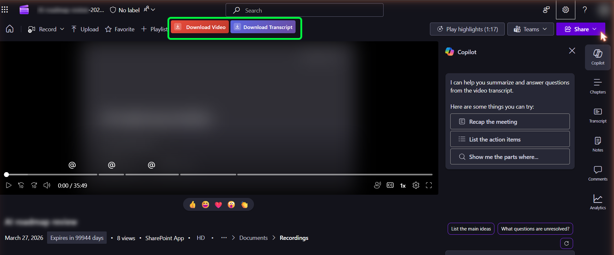
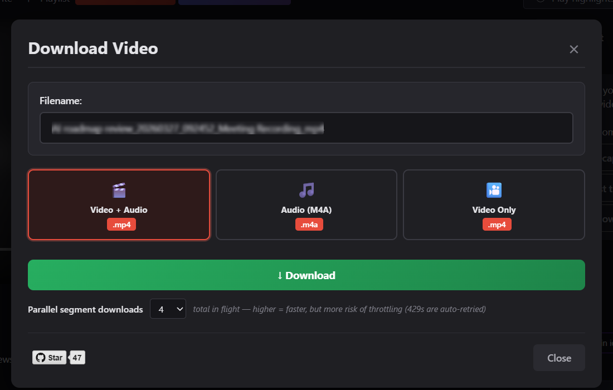
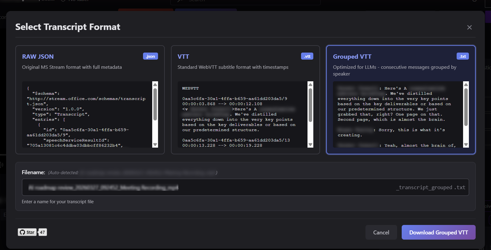

# MS Teams / SharePoint / Stream — Video & Transcript Downloader (Chrome Extension)

🌐 **Website:** [teamsvideotranscriptexporter.com](https://teamsvideotranscriptexporter.com) — features, screenshots, FAQ, install link

Download videos and transcripts from MS Teams meeting recordings, SharePoint, and **Microsoft Stream** (videos uploaded to SharePoint/OneDrive and played through the Stream player) — even when the built-in download button is disabled.

Works on:

- `teams.microsoft.com` and `teams.cloud.microsoft` (Teams web client)
- `*.sharepoint.com` meeting-recording links
- `*.sharepoint.com/.../_layouts/15/stream.aspx` — the Stream-on-SharePoint player (any MP4 someone uploaded to SharePoint or OneDrive and shared)

> **About Microsoft Stream:** Microsoft retired the standalone *Stream (Classic)* product at `web.microsoftstream.com` in early 2024. The current *Stream (on SharePoint)* product reuses the same player whenever an MP4 lives on SharePoint or OneDrive, so this extension covers it automatically.

## Features

### Video / Audio download
- **In-browser download** — Video+Audio (MP4), Audio Only (M4A), or Video Only. No extra tools needed.
- **CLI fallback** — ffmpeg and yt-dlp tabs generate ready-to-paste commands for power users who want MP3/WAV or to drive the download from a terminal.
- **Editable filename** — auto-derived from the page title.
- **Floating banner widget** as a fallback for when the SharePoint command bar re-renders or hides the button.

### Transcript download
- **Automatic detection** — the extension watches for the transcript metadata call and adds a Download Transcript button.
- **Three formats** — RAW JSON, standard WebVTT, or Grouped VTT (consecutive lines from the same speaker collapsed into a block).
- **Live preview** of each format in the modal.
- **Last-used format remembered** across sessions.
- Clear dialog if the meeting was never transcribed, instead of a silent failure.

## Screenshots

> Light-mode versions live next to these in `demo-website/src/assets/screenshots/light/`.

### Teams / SharePoint recording page



### Video download modal



### Transcript format modal



## Installation

### Method 1 — Chrome Web Store

Open <https://chromewebstore.google.com/detail/ms-teams-transcript-downl/hmljlkhcebhkkhbbafiheolbneecoinp> and click **Add to Chrome**.

### Method 2 — Load unpacked (development)

1. Clone or download this repository.
2. Open `chrome://extensions/`.
3. Toggle **Developer mode** on (top right).
4. Click **Load unpacked** and select the `src/` folder.
5. You should see **MS Teams Video & Transcript Downloader** in the list.

## Usage

### Downloading video / audio

1. Open any meeting recording or shared MP4 in Teams, SharePoint, or the Stream-on-SharePoint player.
2. Click the red **Download Video** button in the command bar (or in the floating banner at the top of the page).
3. The modal opens on the **Download** tab — pick a format and click **Download**.
4. *Optional:* switch to the **ffmpeg** or **yt-dlp** tab for MP3/WAV or to drive the download from your terminal. CLI commands embed a short-lived auth token, so generate and run them promptly.

### Downloading the transcript

1. Open the **Transcript** tab on a recording.
2. Click **Download Transcript** in the transcript panel (or in the floating banner).
3. Pick a format in the modal and click **Download**.

Your last-used format is remembered as the default.

## File structure

```
src/
├── manifest.json   # MV3 — intercept.js runs MAIN/document_start, content.js runs ISOLATED/document_idle
├── intercept.js    # fetch() interceptor — captures transcript + video manifest URLs and auth tokens
├── content.js      # UI, transcript flow, video download, modals, floating widget
├── modal.css       # Styles
└── icons/
```

## Permissions

- `storage` — remember the user's last-used transcript format.
- Host permissions on `teams.microsoft.com`, `teams.cloud.microsoft`, and `*.sharepoint.com`.

## Troubleshooting

### Buttons don't appear
1. Refresh the page after installing.
2. Open DevTools (F12) → Console and look for `[Transcript Downloader]` messages.
3. Verify the URL is on `teams.microsoft.com`, `teams.cloud.microsoft`, or `*.sharepoint.com`.
4. Wait a few seconds — the transcript metadata call may not have fired yet.

### Download fails
1. Check the console for errors.
2. Verify the video / transcript actually plays in the native UI.
3. Refresh the page (auth tokens are short-lived) and try again.
4. Confirm you have permission to view the content.

### Extension not working
1. Reload it from `chrome://extensions/`.
2. Clear cache and reload the SharePoint/Teams page.

## Privacy & security

- All processing happens locally in the browser — no data is sent to any external server.
- No tracking, no analytics.
- Open source.
- The extension only uses the same Microsoft URLs the native player already calls.

## Known limitations

- Chrome / Edge only (Manifest V3).
- Only works when you can actually view the content in the native UI — it cannot bypass access restrictions.
- MP3 / WAV require ffmpeg or yt-dlp installed locally (the browser path covers MP4 and M4A).

### Will NOT work in these scenarios

- **DRM-protected videos.** Microsoft DRM-protects some recordings; the bytes can only be decrypted by the browser's built-in DRM module during playback. Neither this extension nor ffmpeg / yt-dlp can produce a playable file. The extension detects this and shows a clear dialog rather than producing a broken download.
- **Guest / unauthenticated viewers.** When SharePoint refuses to mint tokens for guests, the segment downloads fail even though the native player still plays the video. Sign in as a tenant member, or ask the owner to share the file directly via OneDrive.

## License

MIT — see `LICENSE`.

## Reporting bugs

Open an issue on GitHub and pick the **Bug report** template. It asks for the things that actually help diagnose problems:

- Page URL **pattern** (redact tenant/file IDs — only the shape is needed)
- Chrome DevTools console output (F12 → Console → filter by `Transcript Downloader`)
- Screenshots of the page, the modal, or the console
- Extension version and browser/OS

Please redact tenant names, file titles, attendee names, etc. before posting.

## Contributing

Pull requests welcome.

## Credits

Built to help people access their own Teams / SharePoint / Stream recordings and transcripts when the built-in download button is disabled by org policy.

---

**Note:** Intended for accessing your own meeting recordings and transcripts. Respect copyright and privacy policies.
